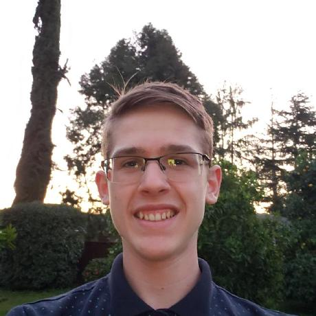
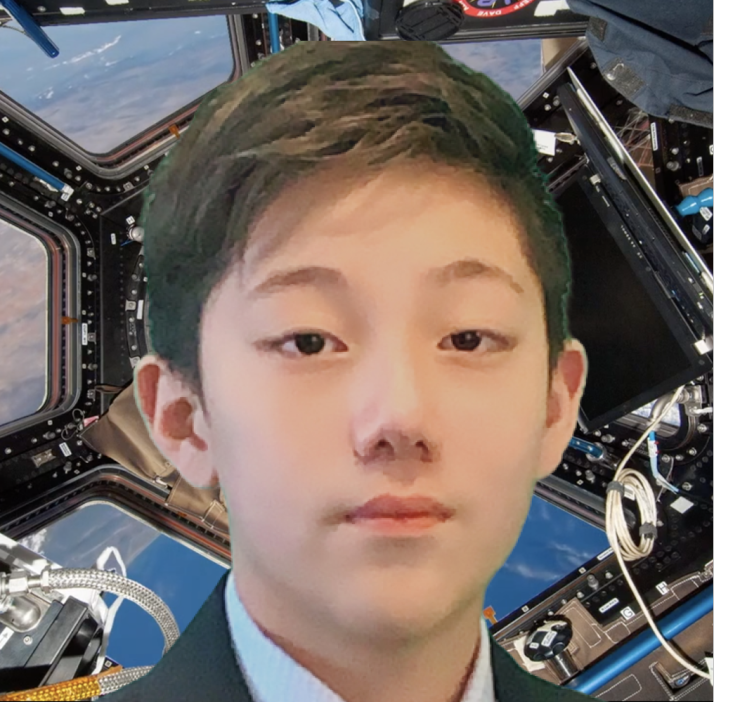
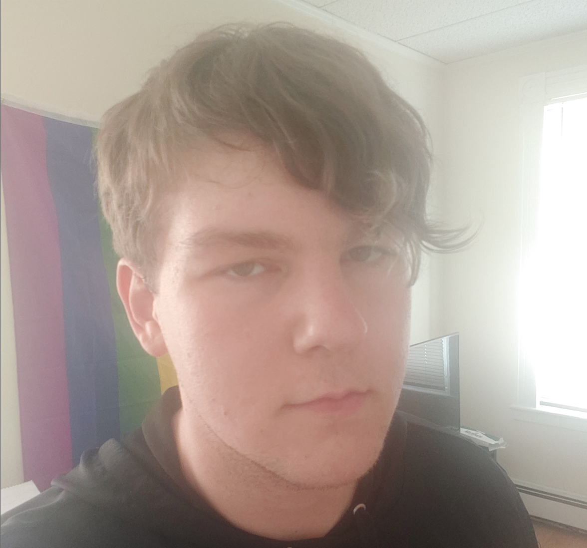
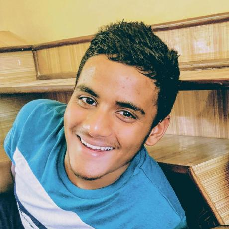
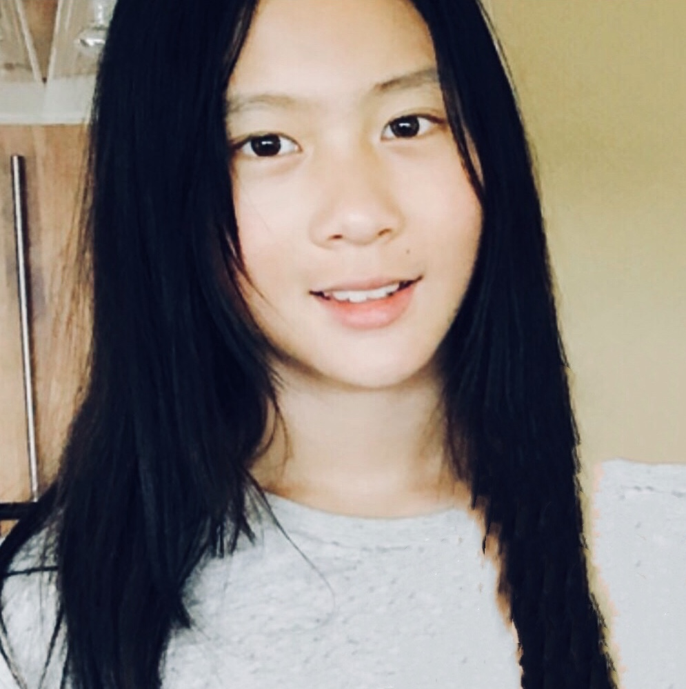
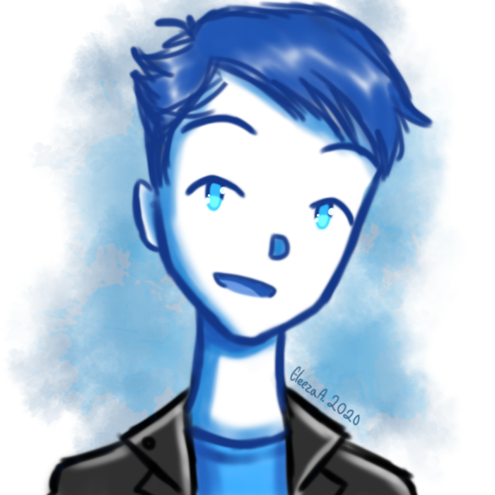

import {
  Banner,
  List,
  Container,
  Callout,
  Gallery,
  FAQ,
  Team,
} from "../components/blocks";
import { Header, Schedule } from "../components/blocks";
import { Box, Button } from "rebass";
import Link from "next/link";
import Sponsors from "../components/sponsors";
import Photo from "../components/photo";

<Banner>

# Sigmoid Hacks

 
 

## Machine Learning Doesn't Have to be Just Another Buzz Word, Make it Real with Sigmoid Hacks!
 
 

<Text
  style={{
    color: "primary",
    fontSize: 35,
  }}
>
  January 15, 2020 @ Your Computer!
</Text>

</Banner>

<Container
width="narrow"
sx={{
    p: {
      fontSize: [2, 3, 4],
      color: 'muted',
      mb: [4, 5],
      lineHeight: 1.375,
      letterSpacing: '-.009em'
    },
    strong: {
      fontWeight: 'medium',
      color: 'text'
    }
  }}>

**Sigmoid Hacks is a 3 day hackathon.**
Hackers, programmers, and makers come together to Sigmoid Hacks to create epic **Artificial Intelligence & Machine Learning** projects.

</Container>

<Gallery>

<Photo
  showAlt
  alt="Sticker Exchange! @CodeDay Ohio"
  src="../static/venue/stickexchange.jpg"
/>
<Photo
  showAlt
  alt="Students build projects in groups @AngelHacks"
  src="https://lh3.googleusercontent.com/OhKms3fdlopgcSVkKfzzwWyTR9iehbYTV53hU3gNBACz9GCodbyFLRYrNecnJ0R2SkutT-wZbTWCljW7E20CD9XCYek4A_oV06UA5NFZQDeIYsUJ-53ZAC7Yno5D7wu5Fald13yXn1gKcpJWx0d0eZkQx52-6Hh8Ffb8kyfaF1E7f53EAl01Lo30q1BeIFT-JOkBjmXh3VTRfCPcvDF4AUsWwjdKkKM17Yw0BZE0VKIherAXXiwpj_EeZXs9ZEWORzXqxggW_v_wylzlmPchUEBaaMEqAGYuVGzNiBpLdXNrws7P1R8rQKAmeTSQ_JkZLuONP9-IPcczxvGoiHzK_pjr1qJGwJcn4VAawFnXDDEr7Qf89xmVwUFXhQhlpBMD0ZjSdiXySMxs5v14-dBDVbW3HKntxagquQ7ZBV9TIm__r9pHpMKwDhMFKqGQvs7uQeij3DhrZyPNf2c4pCZ2kZu3MtGmJSrCWitdWpzAHRBeW6FzdQ0TTwpjqPj7UEKia1P8VZNmwZ3acz6sFsD-tm7j7761KJyTMtxemxpgO1PkewAs7GSySrU2icAmXf3eXqtdhoRe670xUKszTkM750-uNpWFRdsyj1Lg70cgpC3oqb73JEg7H3EiVVnLLKsZ1g5Z8fGYk0BYuTEX4cWE87AQXx7g6M6Tbjdxh-eXtKvGLdQpwWDyP6S3SViPPKCMCLRCNdOEWzxeaVZMYutoGAnZwwvJ2vQtlAPTc1lDQUbpTBSqKQ=w1910-h1432-no"
/>

<Box variant="card">

## A place for everyone.

Underrepresented students are systematically discouraged from pursuing tech. Schools have little to no computer science education programs—and students aren't exposed to programming until late high school or college. We're hoping to encourage students of all backgrounds, ages, and location to learn and love programming. No matter who you are, you’re welcome here—and you’ll surprise yourself by what you can accomplish. 💛

</Box>

<Photo
  showAlt
  alt="Student's presented their ideas to the crowd @AngelHacks"
  src="https://lh3.googleusercontent.com/zofpd6vj_x_W0gcp1QELEMcOdBbS5vaeb1E3-rbMogsqzo57HMJ0o63vlyA7Q9I5N6F94wHuK7I8JJYRShajPd56XZyclGZQWsUAOUGn-76JiYEfDf_DEgo_wMCn2tp5IwmkOc4bYpXcEJTlBuVf1qBjvxL3e8bmQNvUV6NLIYFqudfHISiHR1K8ssaTBtB3l48dSxND6qFsx7wMbk-J20MYfaV6vTKJYW8wQ-WdQzlYwMhdZMwXkmftgXz9sjyQw0S0tZ8wSCNMOQqwIbeYCSi6z6uNgW-Ur41FBPaFE0m-u6EjRW0vNqiosla0fMfmwq4xEIIDK2RJ184JSJyC7zrx890jZDL5QyS4X_4lbld40nmUuTriAR-8o6XAgEgly6uQENmJDyTd2CCmnuzZZwv6bBg7UhY9lLwv0lpmdzHiN5CCf7xbrjcChGwjgUcJ6edutstLbVjWj_hpZtF-ETDzi9HBlGrbJ8NJLolbhNy9vjBNV_WXH9JK3jXemr7vhwNcKxRahBOtAhKWIpoZWi2LvwrArpfL2VBT47Zj5fr-mG0w5ckT6bqPp9pnTcZqJSA4L1BZ_uIfP4PrjCifZwITnnCZ2ng1OIKMRpjo-bcboRksNRHa3GTaVrbq9Hl6SdnIimc1tSxRwGT8Omh8QK-DMoQvW95-xqM6T3k8PJd_ifdEkcyndql1N0_-5KHnSi47dmSH3VwurNkAyFqXv9PMafxPMKmQKzCiy6s_Yq-MtsoeZA=w1910-h1432-no"
/>

</Gallery>

<Container>

## FAQ

<Callout sx={{ mx: [null, null, -3, -4] }}>
<FAQ>

### - How much does it cost? 💸

Nothing! Registration and attendance are 100% free, swag, & workshops included. We'll even have prizes for the top scoring teams/individuals! And you're online so you never have to leave the comfort of your own home!

### - Who can participate? 🔭

All students up to university are welcome.

### - What can I make? 🤖

Anything! Related to ML? Need ideas? Come check out our workshops!

### - What if I’m new to ML? 👾

At SigmoidHacks, complete beginners are not only welcome, but expected! Learn as you go with our intro workshops & mentors.

### - Do I need a team? 👨‍👧‍👧

Nope! You’ll have an opportunity to meet fellow hackers and make teams of up to 3—find some new friends, bring yours, or work alone.

### - What should I bring? 🧳

We're Online! Stay home and remember to use your laptop!

### - Who runs this? 👨‍🏫

We’re independently-organized by high schoolers, sponsored via a nonprofit called <a href="https://hackclub.com/" target="_blank">Hack Club</a>.

</FAQ>
</Callout>

## Prizes

<FAQ>

- **General Winners**
  **1st place:** 40% of prize cash + Guided Tesla Tour and a special plaque!
  **2nd place:** 35% of prize cash + Guided Tesla Tour and a special plaque!
  **3rd place:** 25% of prize cash + Guided Tesla Tour and a special plaque!
- **Best NN From Scratch Project**
  <a href="https://nnfs.io/" target="_blank">
    Sentdex Book
  </a> (Or $75 Amazon gift card)
- **NA Student Project Hack**
  $75 Amazon Gift Card (Must be in Highschool or Middle School)
- ** Most Applicable Hack**
  Jetson Nano
- **Most Visual Project**
  MX Master 3
- **Best Use Of Data**
  Amazon - Echo Dot (3rd Gen)
- **Best Hardware Hack**
  Jetson Nano

</FAQ>

## Judges

Judges will look over your project and evaluate it based on certain factors, such as impact, design, and utility.

<Team sx={{ mb: [4, 5] }}>

- 

  **Maxim Kuznetsov** _Role, Work. he/him/his_

- 

  **Name** _Role, Work. pronouns_

- 

  **Name** _Role, Work. pronouns_

- 

  **Name** _Role, Work. pronouns_

- 

  **Name** _Role, Work. pronouns_

- 

  **Name** _Role, Work. pronouns_

</Team>

## Team

SigmoidHacks is primarily run by a few students at <a href="https://hackclub.com/" target="_blank">Hack Club</a>.

<Team sx={{ mb: [4, 5] }}>

- 

  **John Lins** _Lead Organizer. he/him/his_

- 

  **Eric Zhu** _Co-Lead Organizer. he/him/his_

- 

  **Damian Musk** _Co-Lead Organizer. he/him/his_

</Team>
<Team sx={{ mb: [4, 5] }}>

- 

  **Luke Parkhurst** _Co-Lead Organizer. he/him/his_

- 

  **Aditya Rawat** _Organizer & Web Dev. he/him/his_

- 

  **Claire Wang** _Organizer & Designer. she/her/hers_

</Team>

<Team sx={{ mb: [4, 5] }}>

- 

  **Adrian Lobo** _Co-Lead Organizer. he/him/his_

</Team>

</Container>
