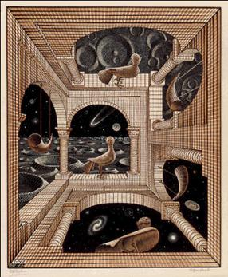

import {
  Banner,
  List,
  Container,
  Callout,
  Gallery,
  FAQ,
  Team,
} from "../components/blocks";
import { Header, Schedule } from "../components/blocks";
import { Box, Button } from "rebass";
import Link from "next/link";
import Sponsors from "../components/sponsors";
import Photo from "../components/photo";

import { motion } from "framer-motion";

<Banner>

<h1>Sigmoid Hacks</h1>

## Machine Learning Doesn't Have to be Just Another Buzz Word, Make it Real with Sigmoid Hacks!

<Gallery>
<a href="https://discord.gg/fam6efTHP7" target="_blank" style={{ textDecoration: "none" }}>
<Box variant="card" style={{ backgroundColor: "black" }}>
<h2 style={{ color: "primary" }}>Discord</h2>
</Box>
</a>

<a href="https://sigmoidhacks.devpost.com/" target="_blank" style={{ textDecoration: "none" }}>
<Box variant="card" style={{ backgroundColor: "black" }}>
<h2 style={{ color: "primary" }}>Devpost</h2>
</Box>
</a>
</Gallery>

<Text
  style={{
    color: "primary",
    fontSize: 35,
    marginTop: -100,
  }}
>
  January 15 - 18, 2021 @ Your Computer!
</Text>

</Banner>

<Container
width="narrow"
sx={{
    p: {
      fontSize: [2, 3, 4],
      color: 'muted',
      mb: [4, 5],
      lineHeight: 1.375,
      letterSpacing: '-.009em'
    },
    strong: {
      fontWeight: 'medium',
      color: 'text'
    }
  }}>

**Sigmoid Hacks is a 3 day hackathon.**
Hackers, programmers, and makers come together to Sigmoid Hacks to create epic **Artificial Intelligence & Machine Learning** projects.

</Container>

<Gallery>
<a
  href="https://hackclub.com/"
  target="_blank"
  style={{ textDecoration: "none", boxShadow: "500" }}
>
  <motion.div
    whileHover={{ scale: 1.1 }}
    whileTap={{ scale: 0.8 }}
    style={{
      borderRadius: "25px",
      textAlign: "center",
      height: "300px",
      backgroundColor: "#ec3750",
      color: "#fff",
      marginTop: "-21px",
    }}
  >
    <h1 style={{ paddingTop: "7.5rem" }}>From Hack Club!</h1>
  </motion.div>
</a>

<motion.div whileHover={{ scale: 1.1 }} whileTap={{ scale: 0.8 }} style={{ borderRadius: "25px", textAlign: "center", height: "300px", backgroundColor: "#ff8c37", color: "white" }}>

# Beginners & Advanced Participants Welcome!

</motion.div>

<motion.div whileHover={{ scale: 1.1 }} whileTap={{ scale: 0.8 }} style={{ borderRadius: "25px", textAlign: "center", height: "300px", backgroundColor: "#5bc0de", color: "white"}}>

# Student Led!

</motion.div>

<motion.div whileHover={{ scale: 1.1 }} whileTap={{ scale: 0.8 }} style={{ borderRadius: "25px", textAlign: "center", height: "300px", backgroundColor: "#33d6a6", color: "white"}}>

# Amazing Prizes!

</motion.div>

</Gallery>

<Container>

## FAQ

<Callout sx={{ mx: [null, null, -3, -4] }}>
<FAQ>

### - How much does it cost? 💸

Nothing! Registration and attendance are 100% free, swag, & workshops included. We'll even have prizes for the top scoring teams/individuals! And you're online so you never have to leave the comfort of your own home!

### - Who can participate? 🔭

All students up to university are welcome.

### - What can I make? 🤖

Anything! Related to ML? Need ideas? Come check out our workshops!

### - What if I’m new to ML? 👾

At SigmoidHacks, complete beginners are not only welcome, but expected! Learn as you go with our intro workshops & mentors.

### - Do I need a team? 👨‍👧‍👧

Nope! You’ll have an opportunity to meet fellow hackers and make teams of up to 3—find some new friends, bring yours, or work alone.

### - What should I bring? 🧳

We're online this year! Stay home and remember to use your laptop!

### - Who runs this? 👨‍🏫

We’re independently-organized by high schoolers, sponsored via a nonprofit called <a href="https://hackclub.com/" target="_blank">Hack Club</a>.

</FAQ>
</Callout>

## Prizes

<FAQ>

- **General Winners**
  **1st place:** 40% of prize cash + Guided Tesla Tour and a special plaque!
  **2nd place:** 35% of prize cash + Guided Tesla Tour and a special plaque!
  **3rd place:** 25% of prize cash + Guided Tesla Tour and a special plaque!
- **Best NN From Scratch Project**
  <a href="https://nnfs.io/" target="_blank">
    Sentdex Book
  </a> (Or $75 Amazon gift card)
- **NA Student Project Hack**
  $75 Amazon Gift Card (Must be in high school or middle school)
- ** Most Applicable Hack**
  <a
    href="https://www.nvidia.com/en-us/autonomous-machines/jetson-store/#jetson-nano"
    target="_blank"
  >
    Jetson Nano
  </a>
- **Most Visual Project**
  <a
    href="https://www.logitech.com/en-us/products/mice/mx-master-3.html"
    target="_blank"
  >
    MX Master 3
  </a>
- **Best Use Of Data**
  <a href="https://www.amazon.com/Echo-Dot/dp/B07FZ8S74R" target="_blank">
    Amazon - Echo Dot (3rd Gen)
  </a>
- **Best Hardware Hack**
  <a
    href="https://www.nvidia.com/en-us/autonomous-machines/jetson-store/#jetson-nano"
    target="_blank"
  >
    Jetson Nano
  </a>

</FAQ>

## Sponsors

Our valuable sponsors allow us to create a quality experience for our participants

<Sponsors />

## Team

SigmoidHacks is primarily run by a few students at <a href="https://hackclub.com/" target="_blank">Hack Club</a>.

<Team sx={{ mb: [4, 5] }}>

- 

  **John Lins** _Lead Organizer. Workshop Host. he/him/his_

- 

  **Eric Zhu** _Co-Lead Organizer. he/him/his_

- 

  **Damian Musk** _Co-Lead Organizer. Workshop Host he/him/his_

</Team>
<Team sx={{ mb: [4, 5] }}>

- 

  **Luke Parkhurst M.D.** _Co-Lead Organizer. Workshop Host. he/him/his_

- 

  **Aditya Rawat** _Co-Lead & Web Dev. he/him/his_

- 

  **Claire Wang** _Co-Lead & Designer. she/her/hers_

</Team>

<Team sx={{ mb: [4, 5] }}>

- 

  **Adrian Lobo** _Organizer. he/him/his_

</Team>

</Container>
